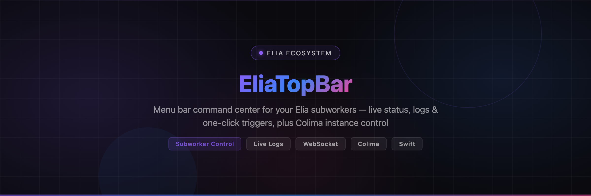
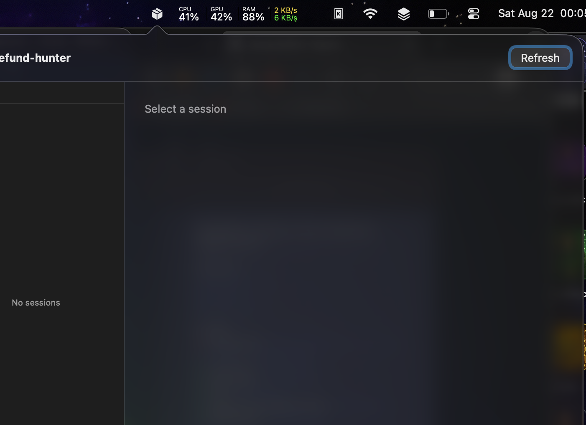
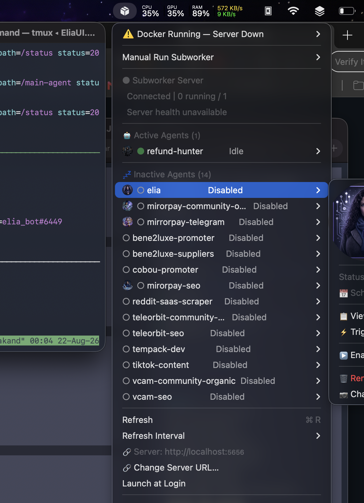

<!-- Banner -->
<p align="center">
  
</p>

<!-- Tagline -->
<p align="center">
  <strong>Native macOS menu bar command center for the Elia agent ecosystem.</strong><br>
  Live subworker status, real-time logs, one-click triggers — plus full Colima instance control.
</p>

<!-- Badges -->
<p align="center">
  <a href="https://github.com/vakandi/Elia-Topbar/blob/main/LICENSE"></a>
  <a href="https://img.shields.io/badge/Swift-5.9-orange"></a>
  <a href="https://img.shields.io/badge/macOS-13%2B-blue"></a>
  <a href="https://github.com/vakandi/EliaAgent"></a>
  <a href="https://img.shields.io/badge/PRs-Welcome-EC4899"></a>
</p>

<!-- UI Screenshots -->
<p align="center">
  
  
</p>

---

## What Is This?

**EliaTopBar** sits in your macOS menu bar and gives you real-time command over the
[Elia agent ecosystem](https://github.com/vakandi/EliaAgent) — without opening a browser
or terminal. It connects over **WebSocket** to the Elia FastAPI server (`localhost:5656`)
and turns every subworker into a live, actionable dashboard row.

- 🟢 **Live agent states** pushed over WebSocket — running, idle, disabled, error, done
- 📍 **Per-agent menu bar icons** — each running subworker gets its own top-bar dot with a
  monogram, colored by state (green = healthy, red = error)
- 🖱️ **Hover-to-view logs** — move your cursor over an agent icon and a real-time log
  overlay appears (2s polling, with loading spinner and full error display)
- ⚡ **Manual Run Subworker** — trigger any subworker on demand from a dropdown
- 🔁 **Enable / Disable, next run, schedule** — per-agent submenu with everything you need
- ❤️ **Server health** — connection state, PID, restart count, reconnect button
- ⏱️ **Loading + error states everywhere** — every server-loaded menu shows a spinner
  while fetching, then data — or the full error message if it fails

It also retains full **Colima** container management: start / stop / restart instances,
open a shell, inspect resources, delete, auto-refresh and launch-at-login.

---

## ✨ Features

### 🤖 Subworker Dashboard (EliaAgent)

| Feature | Description |
|---------|-------------|
| **WebSocket live updates** | Real-time status pushed from the Elia FastAPI server (`ws://localhost:5656/ws`) |
| **Active Agents list** | Every subworker with live state: `⚡ Running`, `⏸️ Idle`, `⛔ Disabled`, `💥 Error`, `✅ Done` |
| **Per-agent top bar icons** | Running agents each get a colored status dot with their monogram in the menu bar |
| **Live log overlay** | Hover an agent icon → real-time logs (`/logs/{name}?lines=50`), refreshed every 2s |
| **Manual Run Subworker** | Trigger any subworker from a dropdown — no terminal needed |
| **Per-agent submenu** | Status, next run, schedule, last run, view logs, trigger now, enable / disable |
| **Server health section** | Connection state, running/total counts, server state + PID + restarts, reconnect |
| **Change Server URL** | Point the app at any Elia server instance |
| **Loading animations** | `NSProgressIndicator` spinner on every server-loaded menu while fetching |
| **Full error display** | Failures show the complete error message (with tooltip on hover) |

### 🐳 Colima Instance Management

| Feature | Description |
|---------|-------------|
| **Instance list** | All Colima instances in the menu, `●` running / `○` stopped |
| **Instance submenu** | Status, arch, CPUs, memory, disk |
| **Start / Stop / Restart** | Control each instance individually |
| **Open Shell** | Launch Terminal and SSH into the running instance |
| **Delete…** | Remove an instance (with confirmation) |
| **Auto-refresh** | Configurable polling interval (5 / 10 / 30 / 60 seconds) |
| **Launch at Login** | Start automatically when you log in |

---

## 🔗 Architecture

```
┌────────────────────────────────────────────────────────────────┐
│  EliaTopBar  (this repo — macOS menu bar app, Swift 5.9)       │
│                                                                │
│   menu bar icon  ◄─── dynamic state (running / error / idle)   │
│   per-agent dots ◄─── monogram + state color per subworker     │
│   log popover    ◄─── hover any agent dot                      │
└──────────────────────────────┬─────────────────────────────────┘
                               │ WebSocket (ws://localhost:5656/ws)
                               │ HTTP  (/status, /trigger, /enable,
                               │        /disable, /logs, /server/health)
                               ▼
┌────────────────────────────────────────────────────────────────┐
│  EliaAgent  (github.com/vakandi/EliaAgent — FastAPI in Docker) │
│                                                                │
│   subworker scheduler  ◄─── agents run on schedule or trigger  │
│   /ws real-time events  ─── initial_status, subworker_completed│
│                            subworker_error, pong               │
└────────────────────────────────────────────────────────────────┘
```

EliaTopBar is the **control surface**; [EliaAgent](https://github.com/vakandi/EliaAgent)
is the **engine**. The app is deliberately thin — all state, scheduling and log storage
lives on the server, and the menu bar just renders it.

---

## 🚀 Quick Start

### Build from Source

```bash
git clone https://github.com/vakandi/Elia-Topbar.git
cd Elia-Topbar
./build-app.sh          # universal arm64 + x86_64, ad-hoc signed
open EliaTopBar.app
```

To create a distributable DMG:

```bash
./build-dmg.sh
```

### Run against your Elia server

1. Make sure the [EliaAgent](https://github.com/vakandi/EliaAgent) FastAPI server is
   running on `localhost:5656` (Docker).
2. Launch EliaTopBar.
3. In the menu, use **Change Server URL…** if your server runs elsewhere.

The app auto-connects on launch — no config file, no env vars.

---

## 📖 Usage

### Menu overview

Click the menu bar icon to open the dashboard:

- **🤖 Subworker Server** — connection status, `Connected │ X running / Y enabled`,
  server health (state, PID, restarts), reconnect when disconnected.
- **🤖 Active Agents** — one row per subworker; hover shows its state dot; click to
  expand: status, next run, schedule, error, last run, **View Logs…**, **⚡ Trigger
  Now**, **⏸️ Disable** / **▶️ Enable**.
- **Manual Run Subworker** — dropdown listing every subworker; pick one to trigger it.
- **Change Server URL…** — point at a different Elia server.
- Colima section — instances, refresh interval, launch at login, quit.

### Per-agent menu bar dots

Running subworkers appear as individual dots in the menu bar:

| Dot | Meaning |
|-----|---------|
| 🟢 Green | Subworker running, no errors |
| 🔴 Red | Last run ended in error |
| Monogram | First letters of the agent name |

**Hover** any dot to open a live log overlay (auto-refreshing every 2s).

### Keyboard shortcuts

| Shortcut | Action |
|----------|--------|
| `R` | Refresh status |
| `Q` | Quit |

---

## ⚙️ Configuration

| Setting | How | Default |
|---------|-----|---------|
| Server URL | Menu → **Change Server URL…** | `http://localhost:5656` |
| Refresh interval | Menu → **Refresh Interval** (Colima section) | 5 s |
| Launch at Login | Menu → **Launch at Login** | off |

---

## ✅ Requirements

| Requirement | Detail |
|-------------|--------|
| macOS | 13.0+ (Ventura or newer) |
| Swift toolchain | 5.9+ (for building from source) |
| [EliaAgent](https://github.com/vakandi/EliaAgent) | FastAPI server, default `localhost:5656` (optional for subworker features) |
| [Colima](https://github.com/abiosoft/colima) | `brew install colima` (optional — only for container management) |

### First launch note

EliaTopBar is ad-hoc signed, not notarized by Apple, so on first launch macOS shows an
"unidentified developer" warning. Right-click the app in Applications and choose **Open**,
then confirm. If macOS still refuses:

```
xattr -dr com.apple.quarantine /Applications/EliaTopBar.app
```

---

## 🤝 Contributing

PRs welcome! Keep it lightweight — this app is intentionally a thin client. Bug reports
and feature ideas are best filed with the exact menu path and, for server-side issues,
in the [EliaAgent](https://github.com/vakandi/EliaAgent) repo.

---

## 📄 License

MIT License — see [LICENSE](LICENSE) for details.
